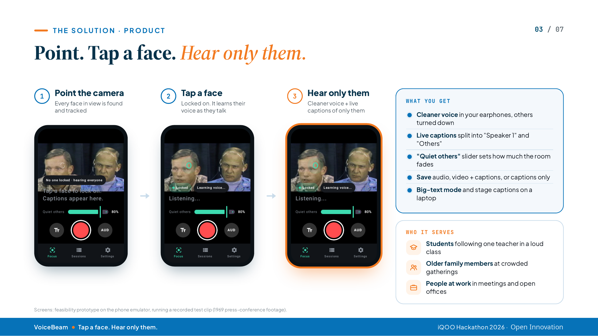
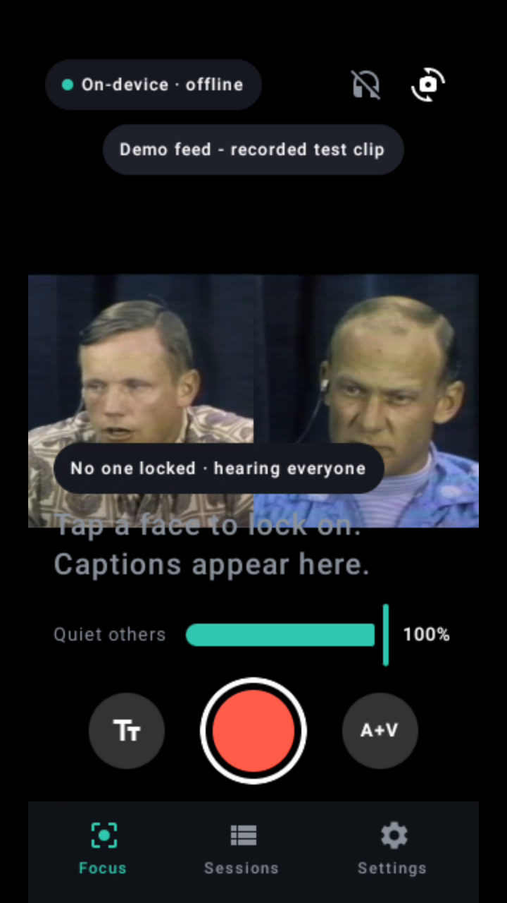
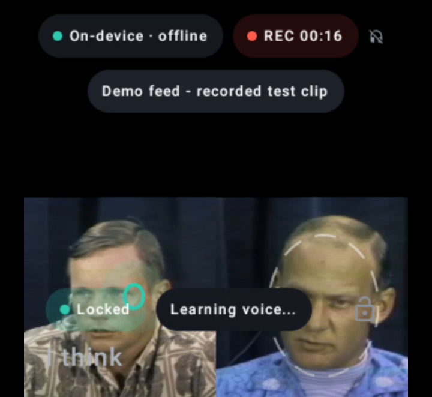
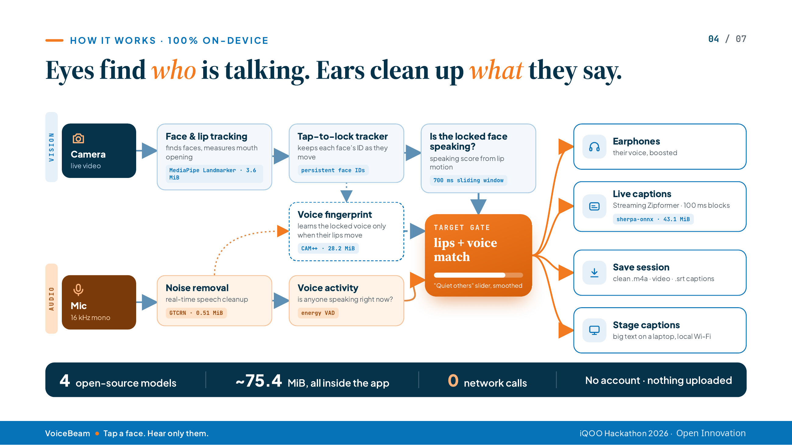

# VoiceBeam

**Tap a face. Hear only them.**

VoiceBeam is an Android app for people who find it hard to follow one voice in a busy room: a classroom, a family dinner, an office meeting. Point the camera at the conversation, tap the person you want to follow, and VoiceBeam brings that voice forward in your earphones while the rest of the room is turned down. Live captions and session recording are on the same screen.

Everything runs on the phone. No account, no internet connection, nothing uploaded.

*Built by Team Vanquishers for the iQOO Hackathon 2026 (Community App).*

<p align="center">
  
</p>

## Why it matters

Around 430 million people worldwide live with disabling hearing loss, a number expected to pass 700 million by 2050 (WHO). Hearing aids amplify the whole room, so in a place with several people talking the one voice you need gets lost. VoiceBeam starts from the person you want to hear instead of from the room.

## Screenshots

Captured on an Android phone running the Focus screen on a recorded test clip.

| Tap a face to lock on | Locked on, voice being learned |
|:---:|:---:|
|  |  |

## Features

- **Tap to lock**: every face in view is tracked; tap one and a ring and lock indicator show who you chose.
- **Quiet others**: a slider sets how far the rest of the room fades.
- **Live captions**: streaming speech recognition, split into "Speaker 1" and "Others".
- **Record**: save audio only (`.m4a`), audio plus video with captions burned in or as `.srt`, or captions only.
- **Sessions**: replay saved sessions, compare raw and clean audio, and export.
- **Big-text mode and stage captions**: large captions on the phone, or on a laptop through a page served on the local Wi-Fi.
- **Private by design**: four open-source models, about 75.4 MiB, all bundled in the app. No network calls.

## Architecture



Two paths run side by side and meet at the target gate.

**Vision path**

1. **Camera** frames go to **MediaPipe Face Landmarker**, which finds faces and measures mouth opening.
2. The **tap-to-lock tracker** keeps a persistent ID for each face as people move.
3. A **speaking score** for the locked face comes from lip motion over a 700 ms sliding window.

**Audio path**

1. **Mic** audio (16 kHz mono) goes through **GTCRN** real-time speech enhancement.
2. A lightweight **voice activity** check (energy VAD) tells whether anyone is speaking.
3. A **voice fingerprint** (**CAM++**) is learned from the locked person's voice, only at moments when their lips are moving.

**Target gate**

The gate combines lip activity with the voice match and drives a smoothed gain. The "Quiet others" slider sets how much everything else is turned down.

**Outputs**

| Output | What it does |
|---|---|
| Earphones | The locked voice, boosted |
| Live captions | Streaming Zipformer (sherpa-onnx), 100 ms blocks |
| Save session | Clean `.m4a`, video, `.srt` captions |
| Stage captions | Large text on a laptop over local Wi-Fi |

### Models

| Role | Model | Size |
|---|---|---|
| Face and lip tracking | MediaPipe Face Landmarker | 3.6 MiB |
| Noise removal | GTCRN | 0.51 MiB |
| Voice fingerprint | CAM++ | 28.2 MiB |
| Captions | Zipformer streaming ASR (sherpa-onnx) | 43.1 MiB |

## Tech stack

- Kotlin and Jetpack Compose (native Android, minSdk 26)
- MediaPipe Face Landmarker for face and lip tracking
- GTCRN for speech enhancement
- CAM++ for speaker embeddings
- sherpa-onnx with a streaming Zipformer for on-device speech recognition

## Setup and build

Requirements: Android Studio (or the Android SDK and a recent JDK), an Android 8.0 (API 26) or newer phone, and a connection for the one-time model download.

```bash
git clone https://github.com/akashrajeev/VoiceBeam.git
cd VoiceBeam

# download the open-source models and sherpa-onnx
bash scripts/fetch_models.sh

# build
./gradlew assembleRelease
```

Install the resulting APK on your phone (for example with `adb install`). After the models are in the app, VoiceBeam works fully offline.

## Usage

1. Open **Focus** and allow camera and microphone access.
2. Point the phone at the people talking. Faces are marked in the preview.
3. Tap the face you want to follow. A ring and a **Locked** chip confirm the choice, and VoiceBeam starts learning that voice.
4. Put in your earphones. Use **Quiet others** to set how much of the room you want to hear.
5. Use the round button to record. Choose audio only or audio plus video with the **A+V** button, and use the **Tt** button for big-text captions.
6. Open **Sessions** to replay or export a recording, and **Settings** to change options.

## Team

**Team Vanquishers**

- Akash Rajeev K V
- Abindas P
- Alan B
